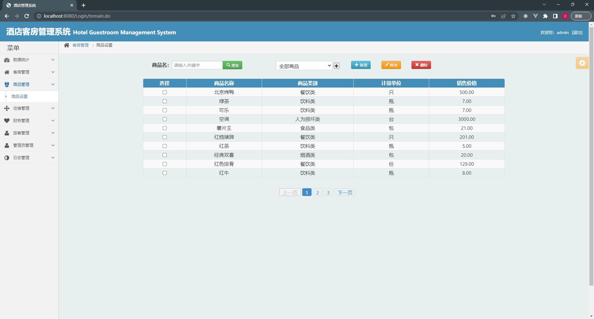

# 酒店管理系统

## 一、介绍

基于spring，spingmvc, mybatis,  jQuery，bootstrap的酒店管理系统

运行环境:idea或eclipse 数据库:mysql

开发语言：java

酒店客房管理系统

有管理员和员工两个角色

基于ssm的酒店管理系统 ，实现了酒店前台信息展示，数据统计，客房管理，商品管理，住宿管理，财务管理，旅客管理等功能；

框架：spring，spingmvc，jQuery，bootstrap

数据库框架：MyBatis

## 二、部分功能页面截图

## 三、 9.9￥ 获取完整源码+sql，需要加Q：3808981644 备用Q：3577148218

